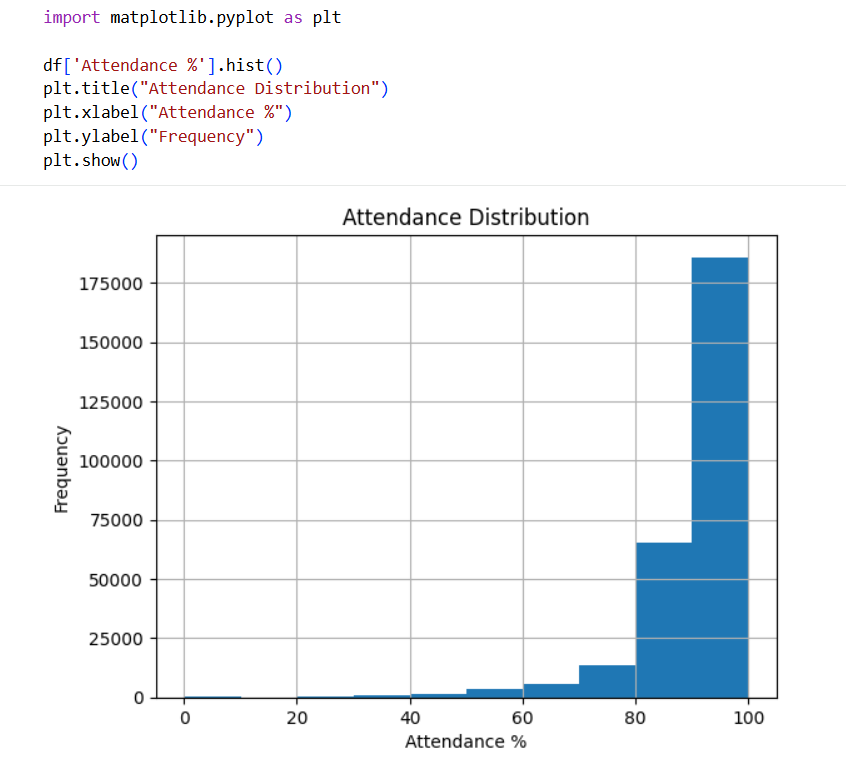
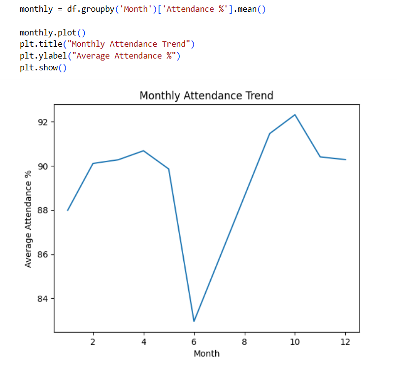

# 📊 Data Cleaning & Reporting Automation using Python

## Project Overview
This project demonstrates **data cleaning, preprocessing, analysis, and reporting** using Python on a real-world school attendance dataset. The objective is to improve data quality, calculate attendance metrics, and generate meaningful reports and visualizations. The dataset was analyzed for missing values, duplicate records, and inconsistent data. Since no data quality issues were found, the cleaned dataset remains identical to the original dataset.

## Technologies Used
* Python
* Pandas
* Matplotlib
* Google Colab
* Microsoft Excel

## Dataset
* **Dataset:** Daily School Attendance Dataset
* **Records:** 277,153
* **Columns:** 6

## Project Workflow
* Data Loading
* Data Cleaning
* Data Transformation
* Attendance Analysis
* Data Visualization

## Results
* ✔ No missing values found
* ✔ No duplicate records found
* ✔ Attendance percentage calculated
* ✔ Automated reports generated
* ✔ Visualizations created

## Project Screenshots
The repository includes screenshots of:
* Dataset Information
* Missing Values Check
* Duplicate Records Check
* Attendance Percentage Calculation
* Top 10 Schools
* Lowest 10 Schools
* Attendance Distribution Chart
  
* Monthly Attendance Trend Chart
  

## How to Run
1. Open the notebook in Google Colab or Jupyter Notebook.
2. Run all cells sequentially.
3. Review the generated reports and visualizations.
